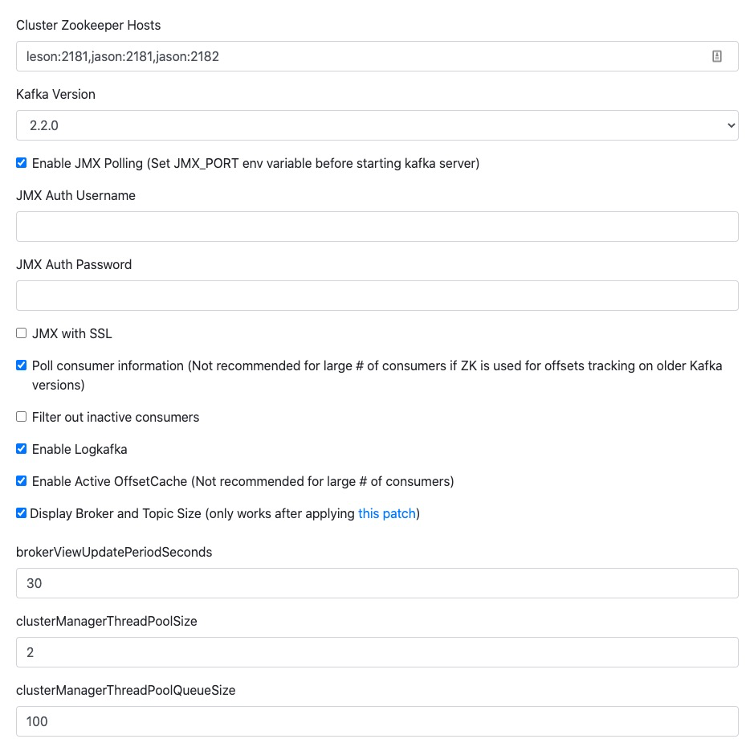
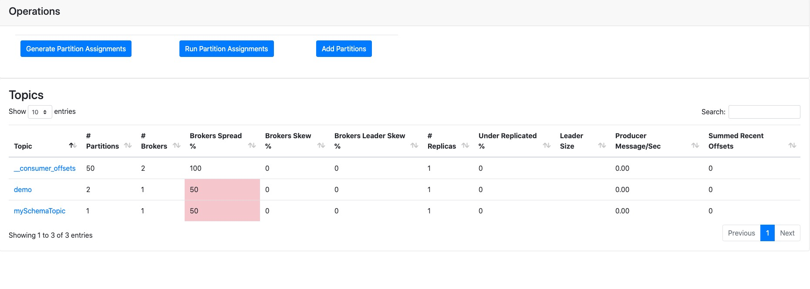
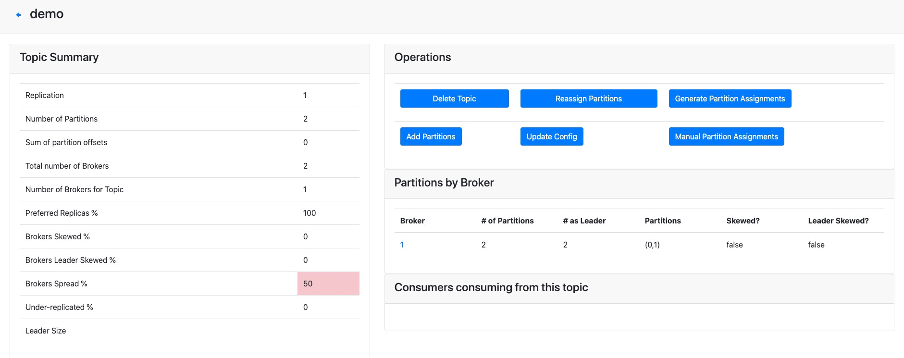

[TOC]

## 环境 
* linux 7.6 双机
* Apache Kafka 2.12-2.5
* Kafka Manager 2.0.0.2
* 源端oracle 12c 单机 未启用插槽
* 源端OGG 191001_fbo_ggs
* 目标端OGG OGG_BigData_Linux_x64_19.1
* [安装文件](http://note.youdao.com/s/ZLWclyrF)

## 1. zookeeper集群
* 使用Apache Kafka自带的zookeeper
* 使用双机配置三个zookeeper节点方式搭建集群， kdb01一个， cent76两个
* 解压文件
```bash
[root@kdb01 ~]$ mv kafka_2.12-2.5.0.tgz  /opt/
[root@kdb01 ~]$ cd /opt/
[root@kdb01 opt]$ tar xvf kafka_2.12-2.5.0.tgz
```

* 修改zookeeper配置
```bash
[root@kdb01 config]$ cd /opt/kafka_2.12-2.5.0/config/
[root@kdb01 config]$ vim zookeeper.properties
 
dataDir=/tmp/zookeeper
# the port at which the clients will connect
clientPort=2181
# disable the per-ip limit on the number of connections since this is a non-production config
maxClientCnxns=0
# Disable the adminserver by default to avoid port conflicts.
# Set the port to something non-conflicting if choosing to enable this
admin.enableServer=false
# admin.serverPort=8080
initLimit=5
syncLimit=2
server.3=kdb01:2888:3888
server.1=cent76:2888:3888
server.2=cent76:2889:3889
```

* 在zookeeper dataDir生成server id文件
```bash
[root@kdb01 config]$ cat /tmp/zookeeper/myid
3
```

* 每个zookeeper节点有自己的配置文件和数据dataDir，并写入id文件
* 启动
```bash
cd /opt/kafka_2.12-2.5.0/
./bin/zookeeper-server-start.sh  config/zookeeper.properties
```

## 2. Kafka集群
`kdb01`, `cent76`各配置一个`Kafka server`节点，组成双节点集群

### 2.1 配置文件

主要配置broker id和zookeeper
```bash
# The id of the broker. This must be set to a unique integer for each broker.
broker.id=3
# A comma separated list of directories under which to store log files
log.dirs=/tmp/kafka-logs
 
# The default number of log partitions per topic. More partitions allow greater
# parallelism for consumption, but this will also result in more files across
# the brokers.
num.partitions=1
zookeeper.connect=kdb01:2181,cent76:2181,cent76:2182
```

### 2.2 启动
* 启动
```bash
./bin/kafka-server-start.sh  config/server3.properties
```

* 开启JMX监听

Kafka manager 可通过JMX获取各节点详细指标信息，在高负载集群下可能有性能问题
```bash
JMX_PORT=9988 ./bin/kafka-server-start.sh  config/server3.properties
```


## 3. Kafka Manager （yahoo/CMAK）

使用开源的[Kafka Manager](https://github.com/yahoo/CMAK)，
注意：2.0.0.2以上版本需要Java 11

### 3.1 下载
KM默认只提供源码，需要编译（很难编译成功），伸手党： https://blog.wolfogre.com/posts/kafka-manager-download/
CMAK 3.0以上提供编译后文件，但需要Java 11环境

### 3.2 配置

```bash
[root@cent76 opt]$ unzip kafka-manager-2.0.0.2.zip
[root@cent76 opt]$ cd kafka-manager-2.0.0.2/
[root@cent76 kafka-manager-2.0.0.2]$ vim conf/application.conf
 
kafka-manager.zkhosts="kafka-manager-zookeeper:2181"
kafka-manager.zkhosts="kdb01:2181,cent76:2181,cent76:2182"
```

### 3.3 启动
```[root@cent76 opt]$
./bin/kafka-manager -Dconfig.file=conf/application.conf -Dhttp.port=9000
```

### 3.4 web访问
http://host:9000

添加集群配置



## 4. 源数据库
### 4.1 开启数据库日志

```sql
[oracle@kdb01 ~]$ sqlplus / as sysdba
SQL> shutdown immediate
Database closed.
Database dismounted.
ORACLE instance shut down.
SQL> startup mount
ORACLE instance started.
 
SQL> alter database archivelog;
 
Database altered.
 
-- 开启日志
SQL> archive log list
Database log mode              Archive Mode
Automatic archival             Enabled
Archive destination            /u01/app/oracle/12c/dbs/arch
Oldest online log sequence     101
Next log sequence to archive   103
Current log sequence           103

-- 打开数据库
SQL> alter database open;
 
-- 开启forcing log
SQL> Alter database add supplemental log data;
SQL> alter system switch logfile;
SQL> alter database force logging;
```

### 4.2 添加GoldenGate支持

```sql
SQL> show parameter enable_goldengate_replication;
NAME                                 TYPE        VALUE
------------------------------------ ----------- ------------------------------
enable_goldengate_replication        boolean     TRUE
-- 支持RAC
SQL> alter system set enable_goldengate_replication=true scope=both ;
SQL> alter system set enable_goldengate_replication=true scope=both sid='*';
```

### 4.3 ogg用户

```sql
-- ogg table space
SQL>create tablespace ogg_tbs datafile '/u01/app/oracle/oradata/orcl/ogg_tbs.dbf' size 5G AUTOEXTEND on extent management local segment space management auto
 
-- ogg user
SQL> create user ggadm identified by "oracle" default tablespace ogg_tbs;
SQL> ALTER USER   GGADM QUOTA UNLIMITED ON  OGG_TBS;
SQL> grant dba,connect,resource,CREATE SESSION to ggadm;
-- 值得注意的是，需要ddl时开启DBA权限
SQL> exec dbms_goldengate_auth.grant_admin_privilege('ggadm');
SQL> exec dbms_goldengate_auth.grant_admin_privilege(grantee=>'ggadm');
SQL> grant select any dictionary to ggadm;
SQL> commit;
```

### 4.4 配置ogg监听(不必须)

```shell
vim /u01/app/oracle/12c/network/admin/tnsnames.ora
 
OGGSource =
  (DESCRIPTION =
    (ADDRESS = (PROTOCOL = TCP)(HOST = kdb01)(PORT = 1521))
    (CONNECT_DATA =
      (SERVER = DEDICATED)
      (SERVICE_NAME = orcl)
    )
  )
```

### 4.5 配置DDL语句支持
```sql
# ogg用户需要dba权限
SQL> grant dba to ggadm;

# 开启ddl支持，值得注意的是，一下操作务必在ggs目录下进行
SQL> @marker_setup.sql;
# 输入准备好的用户ogg

SQL> @ddl_setup.sql;
# 输入准备好的用户ogg 

SQL> @role_setup.sql;
# 输入准备好的用户ogg

# 根据上面执行结果的提示授权角色给ogg用户
SQL> grant GGS_GGSUSER_ROLE to ggadm;

SQL> @ddl_enable.sql;

SQL> @ddl_pin ggadm
```

> 1. 不用重启Oracle
> 2. 因为权限问题，必须在Oracle用户在并且切换到ogg根目录下执行才能成功

### 4.6 重启启动oracle

## 5. 源数据库OGG安装
### 5.1 操作系统ogg用户

```shell
[root@kdb01 home]$ useradd ogg -g oinstall
[root@kdb01 home]$ ls
lost+found  ogg  oracle  xhzhang
```

### 5.2 ogg安装
修改响应文件，ogg 安装路径需要指向一个空目录
```shell
[root@kdb01 home]$ cd ogg/
[root@kdb01 ogg]$ ls
191001_fbo_ggs_Linux_x64_shiphome.zip
[root@kdb01 ogg]$
[root@kdb01 ogg]$ chown -R ogg:oinstall 191001_fbo_ggs_Linux_x64_shiphome.zip
[root@kdb01 ogg]$ su - ogg
[ogg@kdb01 ~]$ unzip 191001_fbo_ggs_Linux_x64_shiphome.zip
[ogg@kdb01 ~]$ cd fbo_ggs_Linux_x64_shiphome/Disk1/response/
# 修改响应文件
[ogg@kdb01 response]$ vim oggcore.rsp
 
INSTALL_OPTION=ORA12c
SOFTWARE_LOCATION=/home/ogg/ogg
START_MANAGER=false
```

安装
```shell
[ogg@kdb01 response]$ mkdir /home/ogg/ogg
[ogg@kdb01 response]$ cd /home/ogg/fbo_ggs_Linux_x64_shiphome/Disk1/
 
[ogg@kdb01 response]$ cd /home/ogg/fbo_ggs_Linux_x64_shiphome/Disk1/
[ogg@kdb01 Disk1]$ ./runInstaller -silent -responseFile /home/ogg/fbo_ggs_Linux_x64_shiphome/Disk1/response/oggcore.rsp
Starting Oracle Universal Installer...
 
Checking Temp space: must be greater than 120 MB.   Actual 25189 MB    Passed
Checking swap space: must be greater than 150 MB.   Actual 2015 MB    Passed
Preparing to launch Oracle Universal Installer from /tmp/OraInstall2020-05-12_05-59-10PM. Please wait ...[ogg@kdb01 Disk1]$ You can find the log of this install session at:
/u01/app/oraInventory/logs/installActions2020-05-12_05-59-10PM.log
Successfully Setup Software.
The installation of Oracle GoldenGate Core was successful.
Please check '/u01/app/oraInventory/logs/silentInstall2020-05-12_05-59-10PM.log' for more details.
```

### 5.3 配置环境变量
```shell
[ogg@kdb01 ~]$ vi ogg.env
 
PATH=$PATH:$HOME/.local/bin:$HOME/bin
export PATH
export ORACLE_BASE=/u01/app/oracle
export ORACLE_HOME=$ORACLE_BASE/12c
export ORACLE_SID=orcl
export NLS_LANG=AMERICAN_AMERICA.UTF8
export ORACLE_TERM=xterm
export PATH=$ORACLE_HOME/bin:/usr/sbin:$PATH
export LD_LIBRARY_PATH=$ORACLE_HOME/lib:/lib:/usr/lib
export LANG=C
export OGG_HOME=/home/ogg/ogg
export PATH=$OGG_HOME:$PATH
export LD_LIBRARY_PATH=$OGG_HOME:$LD_LIBRARY_PATH
 
[ogg@kdb01 ~]$ vim .bashrc
# .bashrc
# Source global definitions
if [ -f /etc/bashrc ]; then
        . /etc/bashrc
fi
 
# Uncomment the following line if you don't like systemctl's auto-paging feature:
# export SYSTEMD_PAGER=
 
# User specific aliases and functions
source ogg.env
```

## 6. OGG源端配置
### 6.1 OGG子文件夹
```shell
[ogg@kdb01 ~]$ source .bashrc
[ogg@kdb01 ~]$ ggsci
 
Oracle GoldenGate Command Interpreter for Oracle
Version 19.1.0.0.1 OGGCORE_19.1.0.0.0_PLATFORMS_190524.2201_FBO
Linux, x64, 64bit (optimized), Oracle 12c on May 25 2019 12:43:32
Operating system character set identified as US-ASCII.
 
Copyright (C) 1995, 2019, Oracle and/or its affiliates. All rights reserved.
 
GGSCI (kdb01) 1> create subdirs
 
Creating subdirectories under current directory /home/ogg
 
Parameter file                 /home/ogg/ogg/dirprm: created.
Report file                    /home/ogg/ogg/dirrpt: created.
Checkpoint file                /home/ogg/ogg/dirchk: created.
Process status files           /home/ogg/ogg/dirpcs: created.
SQL script files               /home/ogg/ogg/dirsql: created.
Database definitions files     /home/ogg/ogg/dirdef: created.
Extract data files             /home/ogg/ogg/dirdat: created.
Temporary files                /home/ogg/ogg/dirtmp: created.
Credential store files         /home/ogg/ogg/dircrd: created.
Masterkey wallet files         /home/ogg/ogg/dirwlt: created.
Dump files                     /home/ogg/ogg/dirdmp: created.
 
GGSCI (kdb01) 2>
```

### 6.2 CredentialStore认证证书

用证书可以免密登录oracle
```sql
GGSCI (kdb01) 2> add credentialstore
 
Credential store created.
 
GGSCI (kdb01) 3> alter credentialstore add user ggadm@oggsource  password oracle alias oggsourceadm
 
Credential store altered.
 
GGSCI (kdb01) 4> dblogin useridalias oggsourceadm
Successfully logged into database.
 
GGSCI (kdb01 as ggadm@orcl) 5>
```

### 6.3 添加表到事务日志组

dblogin登录ggsci后添加表至trandata

```shell
GGSCI (kdb01 as ggadm@orcl) 6> dblogin useridalias oggsourceadm
GGSCI (kdb01 as ggadm@orcl) 6> add trandata demo.teller, allcols
GGSCI (kdb01 as ggadm@orcl) 7> add trandata demo.party, allcols
GGSCI (kdb01 as ggadm@orcl) 8> info trandata demo.party
 
2020-05-12 18:23:06  INFO    OGG-10471  ***** Oracle Goldengate support information on table DEMO.PARTY *****
Oracle Goldengate support native capture on table DEMO.PARTY.
Oracle Goldengate marked following column as key columns on table DEMO.PARTY: ID.
 
Logging of supplemental redo log data is enabled for table DEMO.PARTY.
 
All columns supplementally logged for table DEMO.PARTY.
 
Prepared CSN for table DEMO.PARTY: 6922858
 
GGSCI (kdb01 as ggadm@orcl) 10> add checkpointtable ggadm.checkpoint
```

### 6.4 oracle SCN查询
```bash
[root@kdb01 ogg]$ su - oracle
Last login: Tue May 12 17:32:30 EDT 2020 on pts/6
[oracle@kdb01 ~]$ sqlplus / as sysdba
 
Connected to:
Oracle Database 12c Enterprise Edition Release 12.2.0.1.0 - 64bit Production
 
SQL> select dbms_flashback.get_system_change_number from dual
  2  ;
 
GET_SYSTEM_CHANGE_NUMBER
------------------------
                 7023693
```

### 6.5 生成表结构定义文件
 * 编辑表结构参数文件
```bash
[ogg@kdb01 ogg]$ pwd
/home/ogg/ogg
[ogg@kdb01 ogg]$ ./ggsci
 
GGSCI (kdb01) 1> edit params demodefgen
USERIDALIAS oggsourceadm 
defsfile ./dirdef/demo.def
table demo.*;
 
GGSCI (kdb01) 2> exit
```

* 生成表结构文件
```bash
[ogg@kdb01 ogg]$ ./defgen  paramfile ./dirprm/demodefgen.prm
```

* 同步至目标端

目标端需已有对应目录
```bash
[ogg@kdb01 ogg]$ scp ./dirdef/demo.def  ggs@cent76:/home/ggs/dirdef/
```

### 6.6 manager配置
启动manger需要在OGG_HOME目录，否则会报错
```shell
[ogg@kdb01 ~]$ cd $OGG_HOME
[ogg@kdb01 ogg]$ pwd
/home/ogg/ogg
[ogg@kdb01 ogg]$ ggsci
 
Oracle GoldenGate Command Interpreter for Oracle
Version 19.1.0.0.1 OGGCORE_19.1.0.0.0_PLATFORMS_190524.2201_FBO
Linux, x64, 64bit (optimized), Oracle 12c on May 25 2019 12:43:32
Operating system character set identified as US-ASCII.
 
Copyright (C) 1995, 2019, Oracle and/or its affiliates. All rights reserved.
 
  
GGSCI (kdb01) 1> edit param mgr
 
PORT 7809
DYNAMICPORTLIST 7810-7820
--AUTOSTART ER *
AUTORESTART ER *,RETRIES 5,WAITMINUTES 3, RESETMINUTES 60
PURGEOLDEXTRACTS ./dirdat/*,usecheckpoints, minkeepdays 3
--------------------
--For ddl MGR
--userid ggadm, password oracle
USERIDALIAS oggsourceadm
--PURGEDDLHISTORY MINKEEPDAYS 7, MAXKEEPDAYS 10
--PURGEMARKERHISTORY MINKEEPDAYS 7, MAXKEEPDAYS 10
--------------------
LAGREPORTHOURS 1
LAGINFOMINUTES 30
LAGCRITICALMINUTES 45
 
 
GGSCI (kdb01) 3> start mgr
 
GGSCI (kdb01) 4> info all
 
Program     Status      Group       Lag at Chkpt  Time Since Chkpt
 
MANAGER     RUNNING
 
GGSCI (kdb01) 5> stop mgr
Manager process is required by other GGS processes.
Are you sure you want to stop it (y/n)?y
 
Sending STOP request to MANAGER ...
Request processed.
Manager stopped.
```

### 6.7 extract 配置
```shell
-- RAC时指定treads
GGSCI (kdb01) 8> add extract extdemo, tranlog, begin now, threads 2 # threads参数和Oracle日志组个数相关：
 
 
-- 添加trial文件 文件prefix只能为两个字节
GGSCI (kdb01) 10> add exttrail ./dirdat/de, extract extdemo, megabytes 100
EXTTRAIL added.
```

编辑extract 参数
```shell
GGSCI (kdb01) 36> edit params extdemo
 
extract extdemo
setenv (NLS_LANG=AMERICAN_AMERICA.UTF8)
USERIDALIAS oggsourceadm
-- RAC use
-- TRANLOGOPTIONS DBLOGREADER
TRANLOGOPTIONS MINEFROMACTIVEDG
FETCHOPTIONS NOUSESNAPSHOT
GETTRUNCATES
EXTTRAIL ./dirdat/de
DISCARDFILE ./dirrpt/e1.dsc, APPEND, MEGABYTES 4000
WARNLONGTRANS 1H, CHECKINTERVAL 5M
CACHEMGR CACHESIZE 1024MB, CACHEDIRECTORY ./dirtmp
 
LOGALLSUPCOLS
NOCOMPRESSUPDATES
UPDATERECORDFORMAT FULL
 
REPORTCOUNT EVERY 60 SECONDS, RATE
table demo.*

-- 开始ddl支持
ddl include all
 
-- 指定单表
-- table demo.party;
-- table demo.teller;
 
```

### 6.8 配置pumps进程
```bash
[ogg@kdb01 ogg]$ ./ggsci
 
GGSCI (kdb01) 2> add extract pumpdemo, exttrailsource ./dirdat/de
EXTRACT added.
 
GGSCI (kdb01) 4> add rmttrail /home/ggs/dirdat/de, extract pumpdemo
RMTTRAIL added.
 
GGSCI (kdb01) 5> edit params pumpdemo
 
EXTRACT pumpdemo
setenv (NLS_LANG=AMERICAN_AMERICA.UTF8)
-- For ogg 12.2 DYNAMICRESOLUTION is deprecated
-- pump to remote oracle need the credentialstore for target database
-- DYNAMICRESOLUTION
USERIDALIAS oggsourceadm
discardfile ./dirrpt/p1.dsc,append,megabytes 4000
rmthost cent76 mgrport 7809
rmttrail /home/ggs/dirdat/de
 
PASSTHRU
TABLE demo.*;
```

### 6.9 启动

启动pump时目标端manger应已启动，否则pump可能报错
```bash
GGSCI (kdb01) 5> start mgr
GGSCI (kdb01) 6> start extdemo
GGSCI (kdb01) 7> start pumpdemo
```
> ggsci目录下有ggserror.og dirrpt目录下有详细的report 
## 7. 目标端ggs安装

### 7.1 新增用户

```shell
[root@cent76 ~]$ useradd ggs -g oinstall
```

### 7.2 解压文件
```shell
[root@cent76 ~]$ mv OGG_BigData_Linux_x64_19.1.0.0.0.zip  /home/ggs/
[root@cent76 ~]$ cd /home/ggs/
[root@cent76 ggs]$ chown ggs:oinstall OGG_BigData_Linux_x64_19.1.0.0.0.zip
[root@cent76 ggs]$ su - ggs
[ggs@cent76 ~]$ unzip OGG_BigData_Linux_x64_19.1.0.0.0.zip
[ggs@cent76 ~]$ ls
OGGBD-19.1.0.0.0-README.txt               OGG_BigData_Linux_x64_19.1.0.0.0.tar
OGG_BigData_19.1.0.0.0_Release_Notes.pdf  OGG_BigData_Linux_x64_19.1.0.0.0.zip
[ggs@cent76 ~]$ tar xvf OGG_BigData_Linux_x64_19.1.0.0.0.tar
```

### 7.3 环境变量
```bash
[ggs@cent76 ~]$ vi ggs.env
 
export LD_LIBRARY_PATH=/usr/java/jdk1.8.0_171-amd64/jre/lib/amd64/server/:/usr/java/jdk1.8.0_171-amd64/jre/lib/amd64/jli/:$LD_LIBRARY_PATH
export JAVA_HOME=/usr/java/jdk1.8.0_171-amd64
export PATH=$JAVA_HOME/bin:$PATH
export OGG_HOME=/home/ggs
 
[ggs@cent76 ~]$ echo "source ggs.env" >> .bashrc
[ggs@cent76 ~]$ source .bashrc
```

### 7.4 ggs初始化 
```bash
[ggs@cent76 ~]$ ./ggsci
 
Oracle GoldenGate for Big Data
Version 19.1.0.0.0 (Build 007)
 
Oracle GoldenGate Command Interpreter
Version 19.1.0.0.0 OGGCORE_OGGADP.19.1.0.0.0_PLATFORMS_190618.1416
Linux, x64, 64bit (optimized), Generic on Jun 18 2019 15:37:50
Operating system character set identified as UTF-8.
 
Copyright (C) 1995, 2019, Oracle and/or its affiliates. All rights reserved.
 
GGSCI (cent76) 1> create subdirs
 
Creating subdirectories under current directory /home/ggs
 
Parameter file                 /home/ggs/dirprm: created.
Report file                    /home/ggs/dirrpt: created.
Checkpoint file                /home/ggs/dirchk: created.
Process status files           /home/ggs/dirpcs: created.
SQL script files               /home/ggs/dirsql: created.
Database definitions files     /home/ggs/dirdef: created.
Extract data files             /home/ggs/dirdat: created.
Temporary files                /home/ggs/dirtmp: created.
Credential store files         /home/ggs/dircrd: created.
Masterkey wallet files         /home/ggs/dirwlt: created.
Dump files                     /home/ggs/dirdmp: created.
```

### 7.5 目标端manager
```bash
GGSCI (cent76) 2> edit params mgr
PORT 7809
DYNAMICPORTLIST 7810-7909
AUTORESTART EXTRACT *,RETRIES 5,WAITMINUTES 3
PURGEOLDEXTRACTS ./dirdat/*,usecheckpoints, minkeepdays 30
GGSCI (cent76) 5> start mgr
Manager started.
 
GGSCI (cent76) 6> info all
 
Program     Status      Group       Lag at Chkpt  Time Since Chkpt
 
MANAGER     RUNNING
GGSCI (cent76) 10> info mgr
 
Manager is running (IP port TCP:cent76.7809, Process ID 6634).
```

### 7.6 配置checkpoints
```sql
GGSCI > edit params ./GLOBALS
CHECKPOINTTABLE  ogg.checkpoint
```

### 7.7 配置replicate
* 配置Kafka的replicate
```sql
GGSCI (cent76) 14> add replicat redemo, exttrail ./dirdat/de, checkpointtable ogg.checkpoint
add replicat reens, exttrail ./dirdat/de, checkpointtable ogg.checkpoint
GGSCI (jason) 11> edit param redemo
REPLICAT redemo
TARGETDB LIBFILE libggjava.so SET property=dirprm/kafka.props
REPORTCOUNT EVERY 1 MINUTES, RATE
GROUPTRANSOPS 10000
SOURCEDEFS ./dirdef/demo.def

-- 开启ddl支持
ddl

MAP demo.*, TARGET demo.*;
```

* 添加replicat
```sql
GGSCI (cent76) 17> add replicat re_demo, exttrail ./dirdat/e1, checkpointtable ogg.checkpoint
REPLICAT added.
```

### 7.8 Kafka 配置文件

使用ogg自带的kafka配置文件模版，修改部分信息
```bash
[ggs@cent76 dirprm]$ cp /home/ggs/AdapterExamples/big-data/kafka/kafka.props /home/ggs/AdapterExamples/big-data/kafka/custom_kafka_producer.properties  ./
```

```bash
vi kafka.props
 
gg.handlerlist = kafkahandler
gg.handler.kafkahandler.type=kafka
# producer连接kafka的配置文件
gg.handler.kafkahandler.KafkaProducerConfigFile=custom_kafka_producer.properties
#The following resolves the topic name using the short table name
#gg.handler.kafkahandler.topicMappingTemplate=${tableName}
 
# replicat数据写入的topic
gg.handler.kafkahandler.topicMappingTemplate=demo
#The following selects the message key using the concatenated primary keys
gg.handler.kafkahandler.keyMappingTemplate=${primaryKeys}
#gg.handler.kafkahandler.format=avro_op
gg.handler.kafkahandler.format=json
gg.handler.kafkahandler.SchemaTopicName=mySchemaTopic
gg.handler.kafkahandler.BlockingSend =false
gg.handler.kafkahandler.includeTokens=false
gg.handler.kafkahandler.mode=op
gg.handler.kafkahandler.MetaHeaderTemplate=${alltokens}
 
# use iso8601 format date
gg.handler.kafkahandler.format.iso8601Format=false
gg.handler.kafkahandler.format.includePrimaryKeys=true
 
 
goldengate.userexit.writers=javawriter
javawriter.stats.display=TRUE
javawriter.stats.full=TRUE
 
gg.log=log4j
gg.log.level=INFO
 
gg.report.time=30sec
#Sample gg.classpath for Apache Kafka
#gg.classpath=dirprm/:/var/lib/kafka/libs/*
# kafka jar包依赖 包括ogg本身路径以及kafka安装路径
gg.classpath=dirprm/:/home/ggs/ggjava/resources/lib/*:/opt/kafka_2.12-2.5.0/libs/*
 
#Sample gg.classpath for HDP
#gg.classpath=/etc/kafka/conf:/usr/hdp/current/kafka-broker/libs/*
 
javawriter.bootoptions=-Xmx512m -Xms32m -Djava.class.path=.:ggjava/ggjava.jar:./dirprm
```

```bash
vi custom_kafka_producer.properties
 
#bootstrap.servers=host:port
bootstrap.servers=cent76:9092
acks=1
reconnect.backoff.ms=1000
 
value.serializer=org.apache.kafka.common.serialization.ByteArraySerializer
key.serializer=org.apache.kafka.common.serialization.ByteArraySerializer
# 100KB per partition
batch.size=16384
linger.ms=0
```

### 7.9 启动

```bash
GGSCI (cent76) 21> start mgr
GGSCI (cent76) 22> start redemo
```

## 8. 同步测试
### 8.1 Kafka manager
db工具连接到源库，执行UID操作，在kafka manager可以看到对应的topic及流过的消息





### 8.2 python订阅topic

使用[confluent Kafka](https://www.confluent.io/blog/introduction-to-apache-kafka-for-python-programmers/?utm_medium=sem&utm_source=google&utm_campaign=ch.sem_br.brand_tp.prs_tgt.confluent-brand_mt.mbm_rgn.apac_lng.eng_dv.all&utm_term=%2Bconfluent%20%2Bpython&creative=&device=c&placement=&gclid=CjwKCAjw7-P1BRA2EiwAXoPWAz4fY5ah3tv5v4c3QXyR24EDF1RjQ6lItu4KCoAyghkSpOuE1B4GwBoC8fsQAvD_BwE) pip包订阅topic

```python
from confluent_kafka import Consumer, KafkaError
 
def demo_consumer():
    settings = {
        'bootstrap.servers': 'cent76:9092',
        'group.id': 'demo_con2',
        'client.id': 'client-2',
        'enable.auto.commit': True,
        'session.timeout.ms': 6000,
        'default.topic.config': {'auto.offset.reset': 'smallest'}
    }
 
    c = Consumer(settings)
 
    c.subscribe(['demo'])
 
    try:
        while True:
            msg = c.poll(0.1)
            if msg is None:
                continue
            elif not msg.error():
                print('Received message: {0}'.format(msg.value()))
            elif msg.error().code() == KafkaError._PARTITION_EOF:
                print('End of partition reached {0}/{1}'
                      .format(msg.topic(), msg.partition()))
            else:
                print('Error occured: {0}'.format(msg.error().str()))
 
    except KeyboardInterrupt:
        pass
 
    finally:
        c.close()
 
if __name__ == "__main__":
    demo_consumer()
```


```python
(KAFKA)[python@cent76 kafka_test]$ python demo.py

Received message: b'{"table":"DEMO.PARTY","op_type":"U","op_ts":"2020-05-12 18:30:45.344230","current_ts":"2020-05-12 18:30:51.167001","pos":"00000000000000004205","primary_keys":["ID"],"before":{"ID":110,"PARTY_TYPE_CODE":"ORGANIZATION","NAME":"\xe6\x94\xbf\xe5\xba\x9c\xe6\x9c\xba\xe6\x9e\x84","SHORTCUT":"\xe6\xb5\x8b\xe8\xaf\x95\xe9\x9b\x86\xe7\xbe\xa4"},"after":{"ID":110,"PARTY_TYPE_CODE":"ORGANIZATION","NAME":"\xe6\x94\xbf\xe5\xba\x9c\xe6\x9c\xba\xe6\x9e\x84","SHORTCUT":"\xe6\xb5\x8b\xe8\xaf\x95\xe9\x9b\x86\xe7\xbe\xa4"}}'
```

