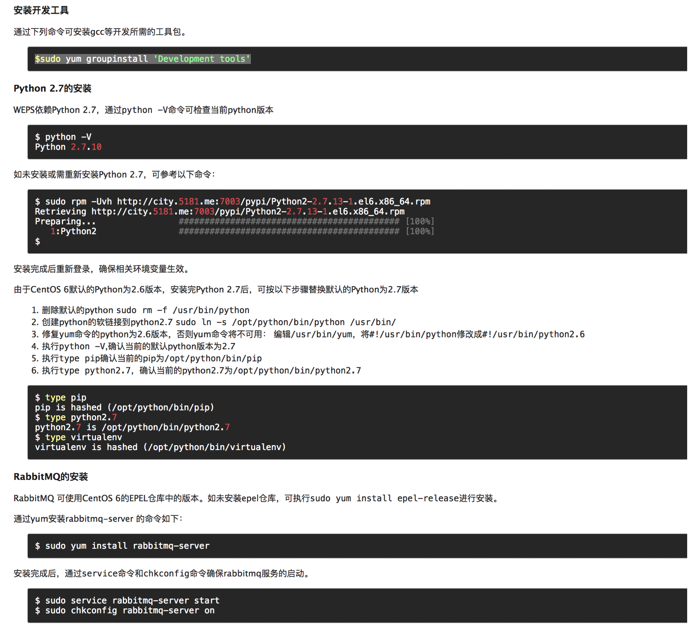

修改pip源：
```bash
# pip.conf
[global]
index-url = http://city.5181.me:7003/pypi/simple
extra-index-url = https://pypi.douban.com/simple
trusted-host = city.5181.me
[list]
format=columns
```

> 以下基于CentOS
开发工具包：
```bash
$ sudo yum groupinstall 'Development tools'
```
安装python2.7
WEPS依赖Python2.7,通过python -V查看Python版本
安装python2.7

```shell
sudo rpm -Uvh http://city.5181.me:7003/pypi/Python2-2.7.13-1.el6.x86_64.rpm
```
由于CentOS 6默认的Python版本为2.6，安装完python2.7以后，替换默认python版本为2.7
```shell
rm -f /usr/bin/python sudo ln -s /opt/python/bin/python /usr/bin/
```
修复yum
```shell
vim /usr/bin/yum
把#!/usr/bin/python修改为#!/usr/bin/python2.6
```
确认当前pip为`/opt/python/bin/pip`



