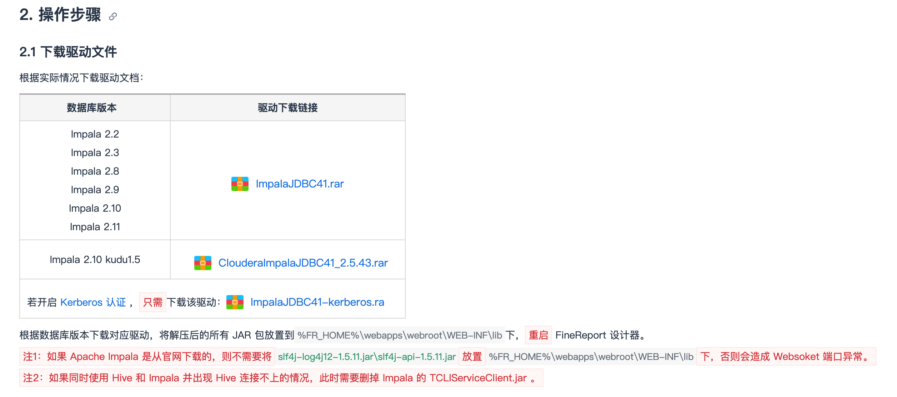

# kreport3演示环境
- 部署服务器：`draco00` `kreport3`
- 项目路径：`/home/kreport3/workspace/project/suining_kreport/`
[http://172.16.16.50:51018](http://172.16.16.50:51018)

# 帆软10试用部署
- 部署服务器：`draco00`
- 部署路径：`/usr/local/tomcat10/tomcat-linux/`
- 帆软数据决策系统后台：[http://172.16.16.50:8081/webroot/decision](http://172.16.16.50:8081/webroot/decision) admin/admin
- 帆软报表url前缀：[http://172.16.16.50:8081/webroot/decision/view/report?__pi__=false&__bypagesize__=false&viewlet=报表路径](http://172.16.16.50:8081/webroot/decision/view/report?__pi__=false&__bypagesize__=false&viewlet=报表路径)

# kanas部署
- 服务器：`cdlab01`
- 用户：`kanas`
- 路径：`/home/kanas/workspace/suining/kanas/`

# 帆软10添加impala驱动后websocket异常
